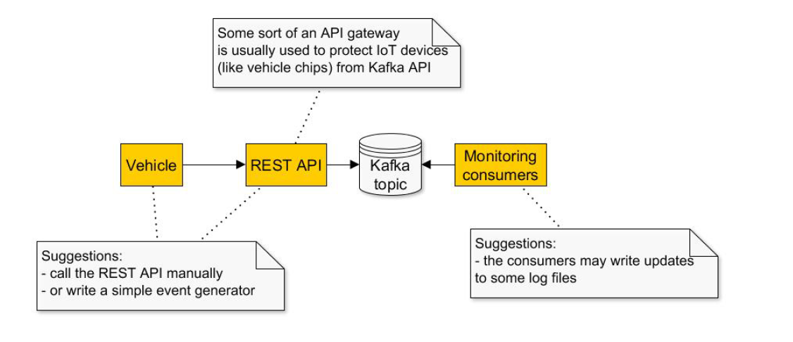

### Kafka

#### Task1
Implement a pair of "at least once" producer and "at most once" consumer.

#### Task2
Implement another pair of producer and consumer with exactly-once
delivery (use the Transactional API)

#### Task3
Implement a taxi application using Spring Boot. The application should
consist of three components:
1. REST service fo sending taxi coordinates and car ID.
2. Kafka broker.
3. Three consumers to calculate the distance traveled by a car.

Important: \
• Messages from every vehicle must be processed sequentially! \
Tips: \
• the first two subtasks may be done as integration tests (for example, using
the Embedded Kafka from Spring Boot)

#### Testing

curl --location --request POST 'http://localhost:1362/epam/kafka/taxi' \
--header 'Content-Type: application/json' \
--data-raw '{
"id":3055,
"coordinates":"51° 40'\'' 31.7892'\'''\'' N | 39° 12'\'' 31.9752'\'''\'' E"
}'